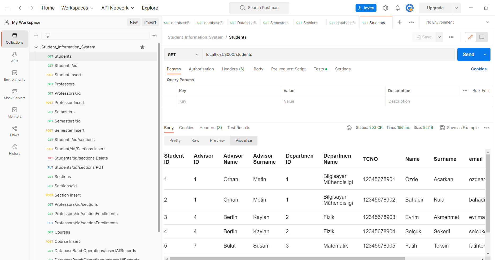
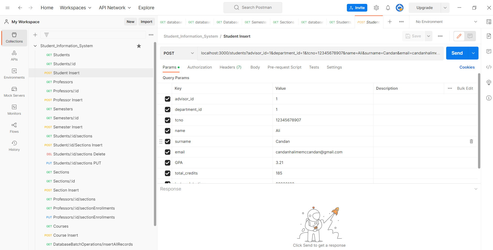
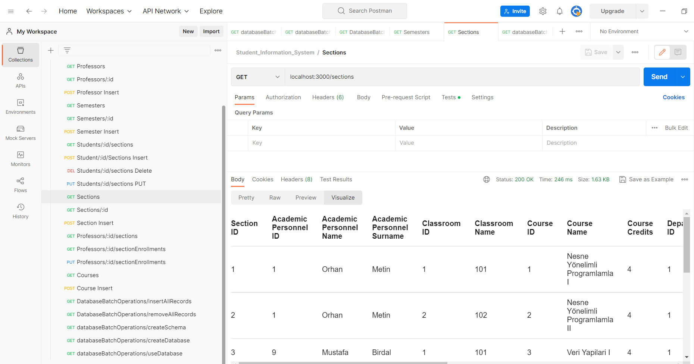

# Student Information System Project

This project is a student information system for universities.

## Tools

[Git](https://git-scm.com/) is used for version management and [GitHub](https://github.com/) is used as online repository. [Docker](https://www.docker.com/) container technology is used for SQL Server and web servers.

## Database

[Microsoft SQL Server](https://www.microsoft.com/en-us/sql-server/) is used as database management system.

## Backend

[ExpressJS](https://expressjs.com/) framework is used on [NodeJS](https://nodejs.org/en) environment as backend.

## Frontend

[NextJS](https://nextjs.org/) and [React](https://react.dev/) is used as frontend. Tests are done with [Postman Client](https://www.postman.com/).

## API

RESTful API is used between backend and frontend.

## Database Design

Database design's Crowd's Foot diagram:


## How to Start Application

- Clone this repository.

```
git clone https://github.com/kendisiz/Student_Information_System.git
npm start
```

- Use docker compose:

```
docker compose up
open localhost:3000/connectdb
open POSTMAN
send queries
```

- Here are some screenshots from POSTMAN:

- Get all students:

  

- Insert a new students:

  

- Get all sections:

  
