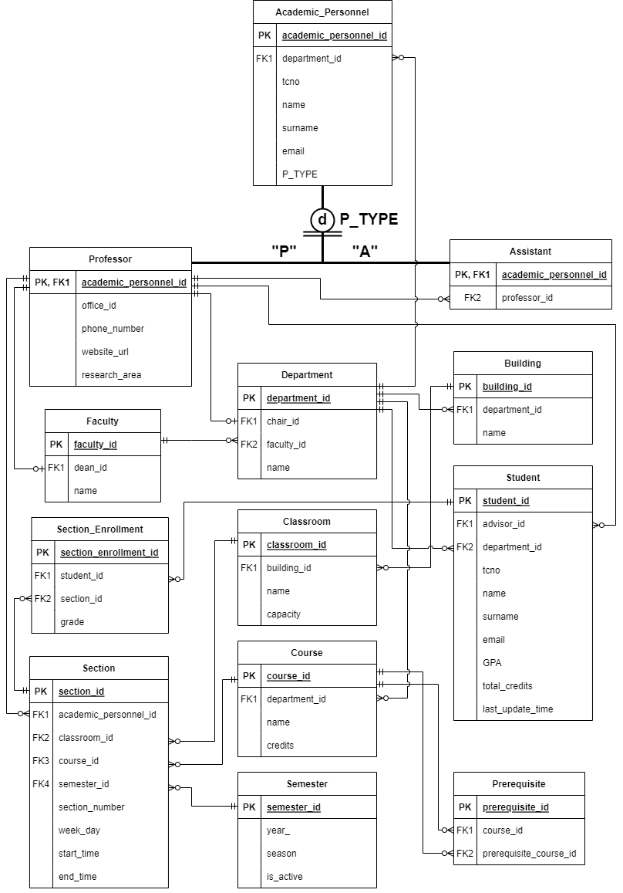

# Student Information System Project

This project is a student information system for universities.

## Database

Microsoft SQL Server is used as database management system.

## Backend

ExpressJS is used as backend.

## Frontend

NextJS and React is used as frontend. Tests are done with Postman Client.

## API

REST API is used between backend and frontend.

## Database Design

Database design's Crowd's Foot diagram:

